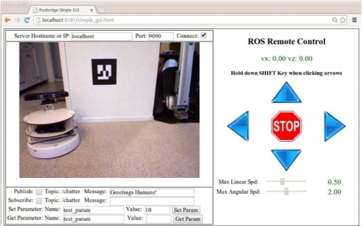

# Подглава 13.5 Простой rosbridge HTML/Javascript GUI

В пакет rbx2\_gui входит простой графический интерфейс HTML/Javascript, определенный в файле rbx2\_gui/simple\_gui.html. Для проверки графического интерфейса на вашем компьютере вам потребуется браузер, совместимый с HTML5, например, Google Chrome. 

Сначала убедитесь, что у вас работает видеодрайвер. Для Kinect или Xtion Pro вы можете использовать: 

`$ roslaunch rbx2_vision openni_node.launch`

Для веб-камеры используйте: 

`$ roslaunch rbx2_vision uvc_cam.launch`

Далее, если вы еще не запустили файл rosbridge.launch, запустите его сейчас: 

`$ roslaunch rbx2_gui rosbridge.launch`

Теперь укажите в вашем браузере следующий URL: 

[http://localhost:8181/simple\_gui.html](http://localhost:8181/simple_gui.html) 

\(Измените номер порта, если вы не смогли использовать порт 8181 для веб-сервера mini-httpd.\) 

ПРИМЕЧАНИЕ. С недавними изменениями как стандартов веб-браузера, так и базы кода JavaScript rosbridge, автор достиг лучших результатов при использовании Google Chrome на Ubuntu 12.04 и планшете Android 4.0. С другой стороны, результаты были несовместимы с использованием Firefox в Ubuntu 12.04, особенно когда дело доходит до потоковых видео. 

Если все выполнено правильно, ваш веб-браузер должен выглядеть примерно так: 

Если вы не увидите видеопоток через несколько секунд, попробуйте перезагрузить веб-страницу. 

Как мы видели ранее, файл rosbridge.launch устанавливает видео топик /camera/rgb/image\_color - тема по умолчанию при использовании файла openni\_node.launch или файла uvc\_cam.launch. Если ваша камера публикует видеопоток в другой теме, измените параметр videoTopic в rosbridge.launch и перезапустите лаунч файл. 

Далее, давайте сосредоточимся на областях выше и ниже видео дисплея. Строка в верхней части содержит текстовое поле для хоста и порта rosbridge, которым были заданы значения по умолчанию localhost и 9090. Флажок изначально установлен и заставляет графический интерфейс подключаться к серверу rosbridge при его первой загрузке. Попробуйте снять флажок, и видеопоток должен исчезнуть или зависнуть. Установите флажок снова, и видео должно снова запуститься. Если видео по какой-то причине не появляется, просто перезагрузите страницу. Мы увидим, как отобразить элементы управления HTML в действия, когда посмотрим на лежащий в основе Javascript. 

Теперь взгляните на область под видео дисплеем. Обратите внимание, что флажки «Publish» \(Опубликовать\) и «Subscribe» \(Подписаться\) в настоящее время не установлены. Откройте окно терминала и введите команду: 

`$ rostopic echo /chatter`

Вы, вероятно, увидите следующее сообщение: 

`WARNING: topic [/chatter] does not appear to be published yet` 

Оставив окно терминала видимым, вернитесь в веб-браузер и установите флажок «Publish» \(Опубликовать\). Вы должны увидеть серию сообщений в терминале, как показано ниже: 

`data: Greetings    
Humans! --- data:    
Greetings Humans! ---    
data: Greetings    
Humans! ---` 

Таким образом, установка флажка «Publish» приводит к публикации сообщения, введенного в текстовое поле «Message» \(Сообщение\) рядом с ним. Теперь установите флажок «Subscribe». Вы должны увидеть, что сообщение "Greetings Humans!" \(Привет, люди!\) появится в текстовом поле Message справа. Не снимая флажки, введите новый текст в поле «Publish». При вводе сообщения в поле «Subscribe Message» \(Подписаться на сообщение\) должно отображаться новое сообщение. В окне вашего терминала, вы также должны увидеть новое сообщение. 

Вы можете проверить кнопки параметров и текстовые поля аналогичным образом. Ввод имени и значения для параметра и нажатие кнопки Set \(Установить\) сохранит это значение параметра на сервере параметров ROS. После ввода имени параметра и нажатия кнопки «Get» \(Получить\) значение параметра будет считано в соответствующее текстовое поле. 

Мы рассмотрим файл simple\_gui.html и связанный с ним Javascript позже. Но сначала давайте попробуем элементы управления навигацией, используя fake TurtleBot. 

